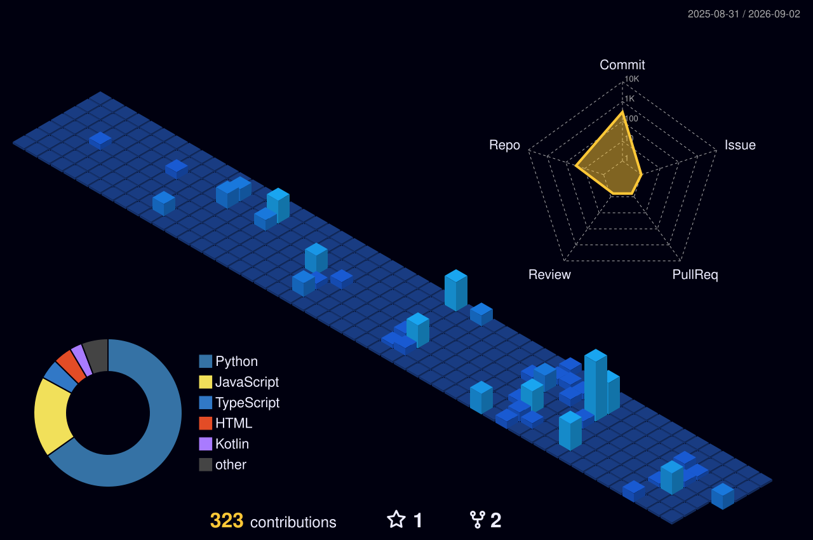

<div align="center">


<a href="https://github.com/rishijain544">
  
</a>

<br/>


</div>

---

<div align="center">


</div>

<table>
<tr>
<td width="50%" valign="top">

### 🧠 [BrainGuard AI](https://github.com/rishijain544/BrainGuard-AI)
**Deep Learning MRI Analysis & Clinical Diagnosis Platform**

Ensemble of CNN + ResNet50 + Vision Transformer models diagnosing brain tumors from MRI scans, with Grad-CAM heatmaps and auto-generated clinical PDF reports.


[](https://brain-guard-ai.vercel.app/)
[](https://github.com/rishijain544/BrainGuard-AI)

</td>
<td width="50%" valign="top">

### 🏦 [IntelliBank](https://github.com/rishijain544/IntelliBank)
**AI-Powered Banking Platform**

Full-stack simulated bank where XGBoost fraud detection (93% recall), credit scoring, and Isolation Forest anomaly detection are wired directly into real transfer/loan logic — not bolted on as a demo.


[](https://github.com/rishijain544/IntelliBank)

</td>
</tr>
<tr>
<td width="50%" valign="top">

### 🎓 [ExamPrepAI](https://github.com/rishijain544/ExamPrepAI_website)
**AI-Powered Exam Preparation Platform**

Turns any lecture PDF or whiteboard photo into MCQs, flashcards, and summaries in seconds using Google Gemini Vision, with progress tracking via Firebase.


[](https://exam-prep-ai-website.vercel.app/)
[](https://github.com/rishijain544/ExamPrepAI_website)

</td>
<td width="50%" valign="top">

### 🚀 [Model Hub Pro](https://github.com/rishijain544/ml_model)
**Interactive ML Playground**

Upload any CSV and train/compare Regression & Classification models on the fly — confusion matrices, ROC curves, feature importance, all in one Streamlit app.


[](https://mlmodel-gyaydbmuxrvkxpzfqcdw4v.streamlit.app/)
[](https://github.com/rishijain544/ml_model)

</td>
</tr>
<tr>
<td width="50%" valign="top">

### 📄 [AI Resume Parser & Ranking System](https://github.com/rishijain544/ai_resume_parser-ranking_system)
**Automated Resume Screening with NLP**

Extracts candidate details from PDF/DOCX resumes and ranks them against a job description using Cosine Similarity, with skill-gap analysis and personalized feedback.


[](https://github.com/rishijain544/ai_resume_parser-ranking_system)

</td>
<td width="50%" valign="top">

<div align="center">

**🔎 [View all repositories →](https://github.com/rishijain544?tab=repositories)**

<br/><br/>

*More projects being added regularly*

</div>

</td>
</tr>
</table>

---

### 🧠 About Me

```python
class RishiJain:
    def __init__(self):
        self.name = "Rishi Jain"
        self.location = "India 🇮🇳"
        self.role = "AI/ML Engineer & Python Developer"
        self.focus = ["Machine Learning", "Deep Learning", "Full-Stack Dev"]

    def say_hi(self):
        print("Thanks for stopping by — let's build something intelligent!")

me = RishiJain()
me.say_hi()
```

- 🔭 Recently shipped **BrainGuard AI** — now building in fintech AI with **IntelliBank**
- 🌱 Exploring the intersection of AI + real product workflows: healthcare, banking, EdTech, hiring
- 💡 Interests: Machine Learning, NLP, Recommendation Systems, Explainable AI
- 📫 Reach me at **rishijain30a@gmail.com**
- ⚡ Fun fact: my repos range from spam classifiers to AI banking fraud engines — I like teaching models to make judgment calls

---

### 🛠️ Tech Stack

<div align="center">

**Languages & Core**


**Machine Learning / AI**


**Tools & Platforms**


</div>

---

### 📊 GitHub Stats & Graphs

<div align="center">


</div>

---

### 🧊 3D Contribution Graph

<div align="center">

</div>

---
### 📊 GitHub Overview & Top Languages

<p align="center">
  
  
</p>

---

### 🌐 3D Contribution Activity

<p align="center">
  
</p>
---

<div align="center">

### 🤝 Connect With Me

[](https://www.linkedin.com/in/rishi-jain-837b75312/)
[](mailto:rishijain30a@gmail.com)
[](https://github.com/rishijain544)

<br/>


**⭐ From [rishijain544](https://github.com/rishijain544) — thanks for visiting!**

</div>
